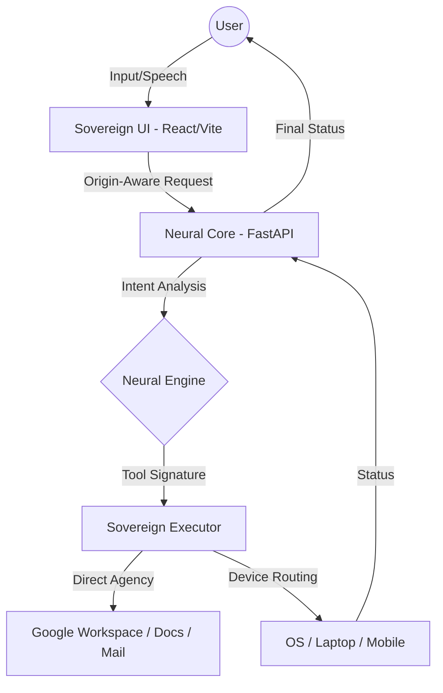

# Saathi — The Sovereign OS Companion

> **Neural Intelligence. Direct Agency. Your Digital Sovereign.**

Saathi is not a chatbot. It is a proactive, OS-level companion designed to bridge the gap between human intent and machine execution. By integrating directly with hardware, workspace environments, and cloud identity, Saathi provides a unified, "Zero-Shot" workflow for the modern power user.

---

## 🌌 The Sovereign Advantage

| Features | Standard AI | Saathi (v113.0) |
| :--- | :--- | :--- |
| **Agency** | Informational | **Direct OS / Hardware Control** |
| **Logic** | Reactive | **Proactive Composition** |
| **Routing** | Single-Device | **Origin-Aware (Mobile/Laptop) Routing** |
| **UI/UX** | Generic Chat | **Premium Glassmorphism Interface** |

---

## 🏗️ Neural Architecture



---

## 🛠️ Core Stack

- **Neural Engine**: Multi-provider LLM Orchestration (Gemini 2.0 Flash / Groq / OpenAI)
- **Identity**: Supabase JWT Auth with Google SSO
- **Backend**: FastAPI (Python 3.12+)
- **Frontend**: Framer Motion + Tailwind + Lucide React
- **Connectivity**: Origin-Aware Smart Redirect System

---

## 🚀 Rapid Deployment

### 1. Neural Core (Backend)
```powershell
cd saathi-api
python -m venv venv
.\venv\Scripts\activate
pip install -r requirements.txt
python -m uvicorn main:app --host 0.0.0.0 --port 8000
```

### 2. Sovereign UI (Frontend)
```powershell
cd saathi-web
npm install
npm run dev
```

---

## 📂 Project Structure

- `saathi-api/`: High-performance FastAPI brain managing memory and tools.
- `saathi-web/`: Premium React dashboard with glassmorphism design.
- `saathi-remote/`: Branded mobile bridge for origin-aware execution.

---

## ⚔️ The Vision
Forged by **Khushi** and **Sharon** in the fires of competition. Saathi represents the pinnacle of agentic autonomy—a system that doesn't just talk, but **acts**.

---
*© 2026 Saathi Intelligence. All Rights Reserved.*
